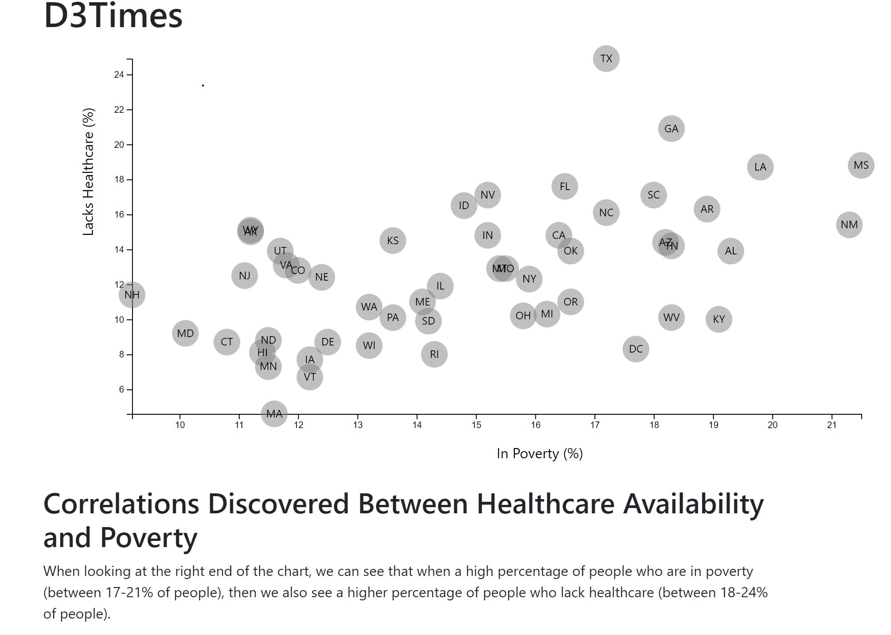

# d3-journalism

## Purpose:
This repo showcases the creation of a simple scatter plot using D3.js.  The chart shows the relationship between the perentage of people lacking healthcare vs. the percentage of people who are in poverty.  

## Tools Used:
* HTML, CSS, JavaScript
* D3.js

## Application Screenshot:
